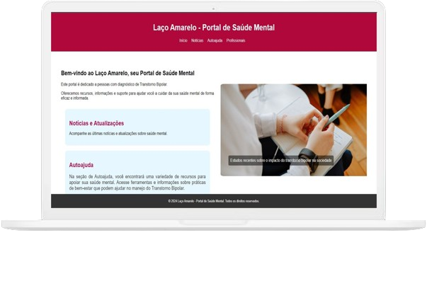
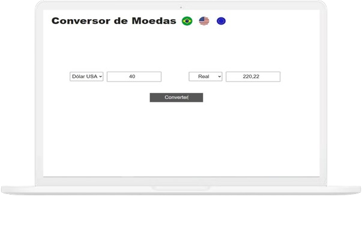
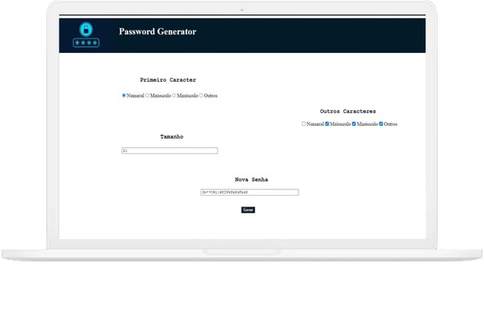

# Portfólio de Evelise Dias

Bem-vindo ao meu portfólio! Sou Evelise Dias, uma desenvolvedora FullStack apaixonada por tecnologia e música. Neste repositório, você encontrará uma coleção dos projetos que desenvolvi ao longo da minha jornada como desenvolvedora. Sinta-se à vontade para explorar e conhecer mais sobre meu trabalho!

## Sumário

- [Sobre Mim](#sobre-mim)
- [Projetos](#projetos)
- [Tecnologias Utilizadas](#tecnologias-utilizadas)
- [Contato](#contato)

## Sobre Mim

Sou uma FullStack Developer residente no Rio Grande do Sul, com experiência em Java e em constante evolução através de cursos de JavaScript. Atualmente, estou expandindo meus conhecimentos em Node.js e React para oferecer soluções mais inovadoras e completas.

Estou graduanda em Análise e Desenvolvimento de Sistemas pela Unisinos e trabalho na Saipos, onde gerencio a implantação de novos clientes e entendo as necessidades dos usuários para melhorar a experiência de desenvolvimento.

## Projetos

### Laço Amarelo

- **Descrição:** Projeto desenvolvido para a avaliação final de uma disciplina na faculdade, focado na saúde mental e especificamente na bipolaridade. O objetivo foi criar uma plataforma informativa para combater a desinformação sobre essa condição.
- **Tecnologias:** JavaScript
- **Imagem:**

- [Repositório no GitHub](#)

### Conversor de Moedas

- **Descrição:** Projeto para aprender a realizar requisições a APIs. O conversor possui uma interface simples e intuitiva, permitindo a conversão de valores entre diferentes moedas.
- **Tecnologias:** JavaScript, JQuery
- **Imagem:**

- [Repositório no GitHub](#)

### Gerador de Senhas

- **Descrição:** Projeto pessoal desenvolvido para aprofundar o conhecimento em métodos JavaScript. O gerador de senhas permite criar senhas seguras com facilidade.
- **Tecnologias:** JavaScript
- **Imagem:**

- [Repositório no GitHub](#)

## Contato

Estou aberta a novas oportunidades e projetos. Se você deseja entrar em contato para discutir como posso contribuir para seu próximo projeto ou se tem interesse em colaborar, não hesite em me contactar!

- **Email:** [evelisemacieldias@gmail.com](mailto:evelisemacieldias@gmail.com)
- **LinkedIn:** [Evelise Dias](https://www.linkedin.com/in/evelise-dias)
- **GitHub:** [evelisedias](https://github.com/evelisedias)

Obrigada por visitar meu portfólio!

---

